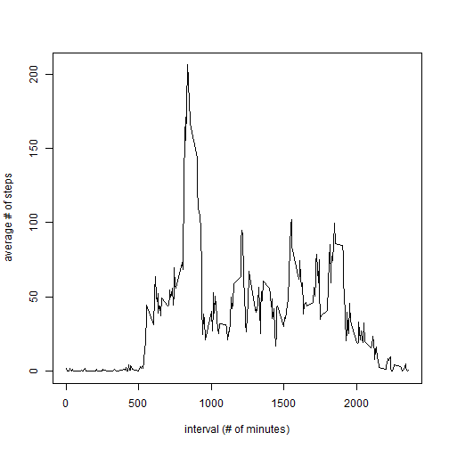

## Loading and preprocessing the data

I downloaded the data file to my computer, so I will set my directory and use read.csv to load the data into R.  I use summary to look at the data.


```r
setwd("~/Reproducible Research/Project1")
Activity <- read.csv("activity.csv")
summary(Activity)
```

```
##      steps                date          interval     
##  Min.   :  0.00   2012-10-01:  288   Min.   :   0.0  
##  1st Qu.:  0.00   2012-10-02:  288   1st Qu.: 588.8  
##  Median :  0.00   2012-10-03:  288   Median :1177.5  
##  Mean   : 37.38   2012-10-04:  288   Mean   :1177.5  
##  3rd Qu.: 12.00   2012-10-05:  288   3rd Qu.:1766.2  
##  Max.   :806.00   2012-10-06:  288   Max.   :2355.0  
##  NA's   :2304     (Other)   :15840
```

The data seems fairly clean so I will not complete any preprocessing steps.

## What is mean total number of steps taken per day?

After reading the data, I use complete.cases to create a new data fram with no null values.  
Then I use ddply from the plyr package to find the total number of steps each day, and create the histogram of that information.


```r
nnActivity <- Activity[complete.cases(Activity),]
require(plyr)
```

```
## Loading required package: plyr
```

```r
sumsteps <- ddply(nnActivity,c("date"),summarize,totalsteps = sum(steps))
hist(sumsteps$totalsteps, xlab = "number of steps", main = "Frequency of # of steps", col= "orange")
```

 


The mean # of steps is:


```r
mean(sumsteps$totalsteps)
```

```
## [1] 10766.19
```

The median # of steps is:

```r
median(sumsteps$totalsteps)
```

```
## [1] 10765
```


## What is the average daily activity pattern?

For this question, I use ddply again to create another data frame, this time to find the average number of steps for each time interval.  Using the plot function I make a graph of the average # of steps vs. the time interval. 


```r
meansteps <- ddply(nnActivity, c("interval"),summarize,avesteps = mean(steps))

plot(meansteps$interval,meansteps$avesteps,type = "l", xlab = "interval (# of minutes)", ylab = "average # of steps")
```

 

The time interval with the highest average # of steps is:


```r
meansteps[which.max(meansteps$avesteps),"interval"]
```

```
## [1] 835
```


## Imputing missing values

I use the is.na function to check which columns have N/A values in the original data frame

```r
any(is.na(Activity[,"steps"]))
```

```
## [1] TRUE
```

```r
any(is.na(Activity[,"interval"]))
```

```
## [1] FALSE
```

```r
any(is.na(Activity[,"date"]))
```

```
## [1] FALSE
```

Only the steps column has null values.  The number of null values is:


```r
length(Activity$steps[is.na(Activity$steps)])
```

```
## [1] 2304
```

I use the suggestion in the assignment and decide to replace the null values with the average # of steps for that time interval (across all days).  I use a for loop and an if statement to check each row, deterime if the number of steps is null, and replace the value if it is null.

```r
estActivity <- Activity
for (i in 1:nrow(Activity)) {
  if (is.na(estActivity[i,]["steps"])) {
    x <- meansteps[meansteps$interval == estActivity$interval[i],]
    estActivity[i,]["steps"] <- x$avesteps
  }
}
```

I use ddply to find the total steps each day, and create a histogram.

```r
sumstepsest <- ddply(estActivity,c("date"),summarize,avesteps = sum(steps))
hist(sumstepsest$avesteps, xlab = "number of steps", main = "Freq. of # of steps (with est. values)", col="orange")
```

 

For the data with these estimated values, the mean is


```r
mean(sumstepsest$avesteps)
```

```
## [1] 10766.19
```

The median is:


```r
median(sumstepsest$avesteps)
```

```
## [1] 10766.19
```

The mean hasn't changed and now the median is the same as the mean.  In the data without null values the median was slightly less than the mean, implying that the distribution was slightly skewed.  With the null values replaced with estimates, the mean and median are the same, which implies it is a normal distribution. 


## Are there differences in activity patterns between weekdays and weekends?
I add another column called timeofweek to the data frame with the estimated values.  I use the weekdays function to determine which dates are Saturday and Sunday, and code those as "weekend".  The remaining timeofweek rows are currently null, so I will use is.na to change those rows to "weekday" (I know they are not Saturday or Sunday so they *should* all be weekdays)


```r
estActivity$timeofweek[weekdays(as.Date(estActivity$date))==c("Saturday","Sunday")]<- "weekend"
estActivity$timeofweek[is.na(estActivity$timeofweek)] <- "weekday"
estActivity$timeofweek <- as.factor(estActivity$timeofweek)
```


I find the average number of steps for each interval and weekend/weekday.  Then I use xyplot from the lattice package to create a stacked plot of activity during the timeframes.

```r
meanstepsest <- ddply(estActivity, c("interval","timeofweek"),summarize,meansteps = mean(steps))

require(lattice)
```

```
## Loading required package: lattice
```

```r
xyplot(meansteps~interval|factor(timeofweek),meanstepsest, type = "l", as.table=TRUE)
```

 

Unfortunately, those these plots show up one stacked on top of the other in Rstudio when I run the code from the console, it's showing up side by side in knitr.  It's harder to look at the graphs in this format, but it looks as though on weekends the amount of activity throughout the day varies more than on the weekdays.
